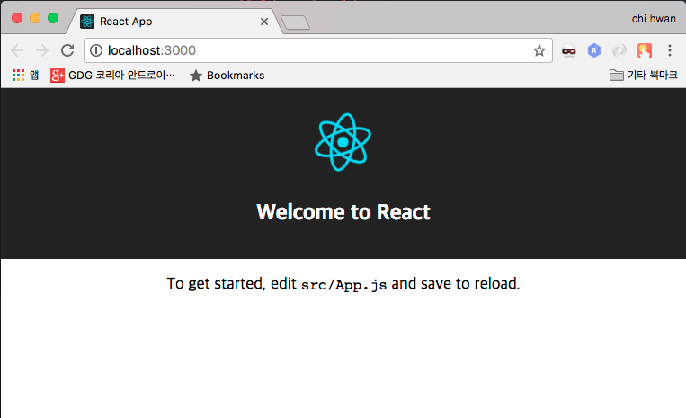

# React 스터디
## Redux 실습 해보기

## 실습 내용
### Create-React-App 사용해서 프로젝트 생성
#### npm install -g create-react-app
#### create-react-app redux-example

### 생성된 프로젝트 실행 해보기
#### npm start

### Redux 설치
#### npm install --save redux
#### npm install --save react-redux

### Redux 사용하기 =

### 참조
#### React & Express 를 이용한 웹 어플리케이션 개발하기
#### https://www.inflearn.com/course/react-%EA%B0%95%EC%A2%8C-velopert/
